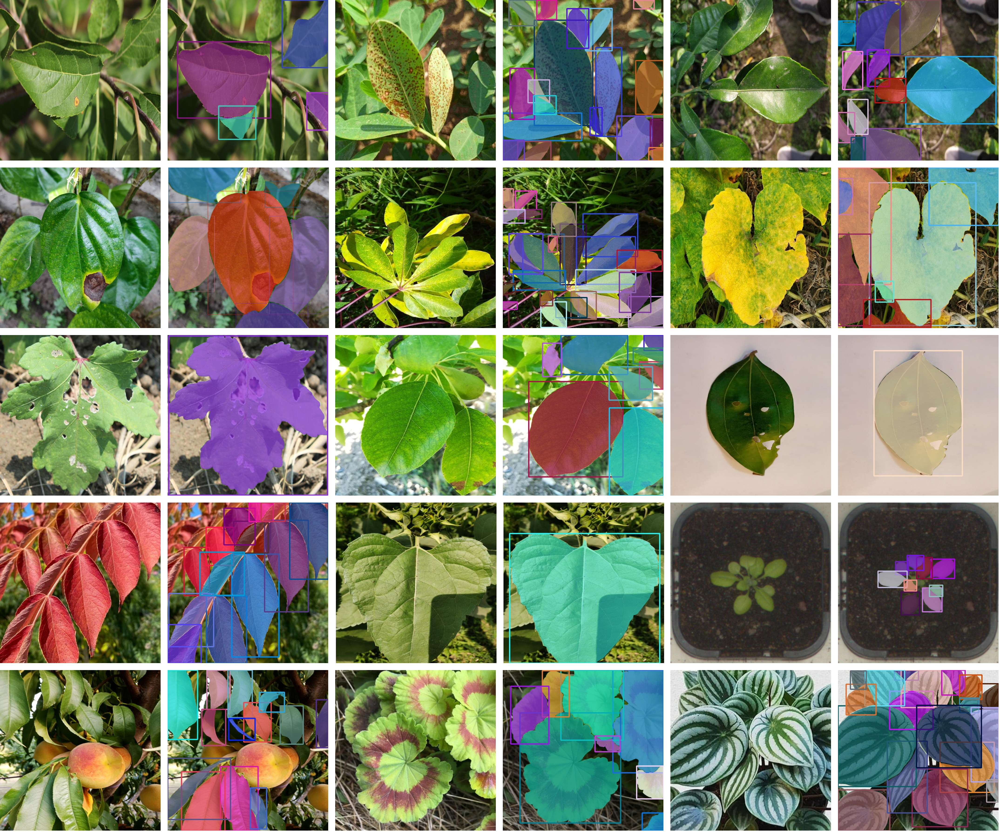

  

## LeavesBank Dataset: An Instance Leaf Segmentation Dataset with 220K Instances Across Different Plant Types and Task

  
  
  
  
  
  

## 👋 Welcome

Hi! Welcome to "The Leaves Bank Dataset" official repository. Leafbank dataset was created by labeling 13 different publicly available datasets using a semi-automated active learning pipeline.During dataset development, care was taken to include not only plant diversity but also various plant tasks such as growth monitoring, disease classification, and phenotyping, as well as image quality. Detailed explanations are below 👇.

---------

 ## 🗃️ Datasets Used For This Study
 The following table contains information about a dataset including JSON annotations for images of leaves belonging to more than 13 plant species. In the Task column, Disease C. = Disease Classification.
In the Camera column, Digital Cam. = Digital Camera. In the Background column, N = Natural, M = Mixed, C = Controlled.

| Dataset | Plant Type | Leaf Form | Image Count | Task | Region | Camera | Background | Excluding Criteria | 
|--------|------------|-----------|-------------|------|--------|--------|------------|--------------------|
| [Plant Pathology (2021)](https://www.kaggle.com/competitions/plant-pathology-2021-fgvc8)| Apple | Basic | 18,632 | Phenotyping | Europe, USA | Various | N | All |
| [PlantNet](https://zenodo.org/records/4726653) | Various | Mixed | 2,859 | Phenotyping | Various | Various | M | Sample |
| [Betel Leaf Dataset](https://zenodo.org/records/4726653) | Pepper | Basic | 750 | Disease C. | Asia | Smartphone | N | Sample |
| [icassava2019](https://www.kaggle.com/competitions/cassava-disease/data) | Cassava | Compound | 996 | Disease C. | Africa | Smartphone | N | Sample |
| [Cinnamomum Tamala](https://data.mendeley.com/datasets/s9t7sr52wg/2)| Bay Leaves | Basic | 5,696 | Disease C. | Asia | Smartphone | C | All |
| [Ground Nut Leaf Dataset](https://data.mendeley.com/datasets/x6x5jkk873/2) | Ground Nut | Compound | 1,263 | Disease C. | Asia | Smartphone | N | All |
| [Lemon Leaf Dataset](https://data.mendeley.com/datasets/rcyyf5j9zg/1) | Lemon | Basic | 2,094 | Disease C. | Asia | Not Applicable | N | All |
| [Okra DiseaseNet](https://data.mendeley.com/datasets/nh7zk4hv8z/1) | Okra | Compound | 1,500 | Disease C. | Asia | Digital Cam. | N | All |
| [Peach Dataset](https://data.mendeley.com/datasets/3pmj85snvw/1) | Peach | Basic | 285 | Disease C. | Asia | Smartphone | N | Sample |
| [Diamos Dataset](https://zenodo.org/records/5557313) | Pear | Basic | 2,964 | Disease C. | Europe | Various | N | Sample |
| [Pumpkin Leaf Dataset](https://data.mendeley.com/datasets/wtxcw8wpxb/1) | Pumpkin | Compound | 2,000 | Disease C. | Asia | Smartphone | N | All |
| [Sunflower Dataset](https://data.mendeley.com/datasets/b83hmrzth8/1) | Sunflower | Basic | 389 | Disease C. | Asia | Digital Cam. | N | Sample |
| [CVPPP 2017](https://www.plant-phenotyping.org/datasets-home) | Tobacco, Arabidopsis | Compound | 804 | Phenotyping | Asia | Various | C | All |

------------------

## 🧠 Extracted Instances 
Data was labeled using a semi-automated active learning approach developed with YOLOv11 and Segment Anything 2. As a result, 39,232 images were labeled and 220,600 instances were extracted. Detailed information and visuals regarding the extracted instances are as follows.

| Dataset | Image Count | Extracted Leaf Instances | Extracted Secondary Leaf Instances | Total Instances | Avg. Instances / Image |
|--------|-------------|--------------------------|-----------------------------------|-----------------|------------------------|
| Plant Pathology (2021) | 18,632 | 68,182 | 13,397 | 81,579 | 5 | 
| PlantNet | 2,859 | 25,122 | 796 | 25,918 | 9 |
| Betel Leaf Dataset | 750 | 1,632 | 264 | 1,896 | 3 |
| icassava2019 | 996 | 27,403 | 2,124 | 29,527 | 30 |
| Cinnamomum Tamala | 5,696 | 5,700 | 0 | 5,700 | 1 |
| Ground Nut Leaf Dataset | 1,263 | 11,547 | 1,169 | 12,516 | 10 |
| Lemon Leaf Dataset | 2,094 | 12,288 | 1,140 | 13,428 | 7 |
| Okra DiseaseNet | 1,500 | 3,158 | 179 | 3,337 | 3 |
| Peach Dataset | 285 | 3,470 | 79 | 3,549 | 13 |
| Diamos Dataset | 2,964 | 21,565 | 3,717 | 25,282 | 9 |
| Pumpkin Leaf Dataset | 2,000 | 7,956 | 0 | 7,956 | 4 |
| Sunflower Dataset | 389 | 2,325 | 73 | 2,398 | 6 |
| CVPPP 2017 | 804 | 8,191 | 0 | 8,191 | 10 |
| **Total** | **39,232** | **198,489** | **22,938** | **221,427** |  |  

The visual representing our data and labels, which include more than 13 different plant species and different plant tasks, is as follows:

------------------

## 🧪 Testing Results 
To demonstrate how LeafBank's rich data repository contributes to classical architectures, we trained YOLOv11 variants. The test results are shown in the table.

| YOLOv11 Variant | Prec | Rec | mAP50 | mAP50-95 |
|-----------------|------|------|-------|---------|
| Extra Large     | 0.876 | 0.861 | 0.937 | 0.848 |
| Large           | 0.874 | 0.863 | 0.937 | 0.846 |
| Medium          | 0.878 | 0.859 | 0.936 | 0.845 |
| Small           | 0.873 | 0.853 | 0.933 | 0.838 |
| Nano            | 0.867 | 0.844 | 0.926 | 0.817 |

 

https://github.com/user-attachments/assets/06e4ea6c-3b15-42a9-8b5e-b377b31e2906

We also used Leafbank to compare the zero-shot performance of various YOLO features from the literature with the state-of-the-art SAM3 model and extensive studies.

  
### Model Performance Comparison (mAP50 / mAP50-95)

| Model | Komatsuna | SoyCotton | Growliflower | Potato Leaf |
|------|-----------|-----------|---------------|-------------|
| SAM3 | 0.75 / 0.61 | 0.81 / 0.68 | 0.62 / 0.41 | 0.84 / 0.66 |
| LeafGEN | 0.63 / - | - / - | - / - | - / - |
| G-SAM | 0.48 / - | - / - | - / - | - / - |
| Leaf Only SAM | 0.55 / - | - / - | - / - | 0.74 / 0.58 |
| Xing et al. | - / - | - / - | 0.61 / - | - / - |
| YOLOv11n | 0.75 / 0.59 | 0.76 / 0.52 | 0.64 / 0.42 | 0.63 / 0.42 |
| YOLOv11s | 0.83 / 0.64 | 0.81 / 0.58 | 0.66 / 0.46 | 0.71 / 0.47 |
| YOLOv11m | 0.85 / 0.65 | 0.81 / 0.59 | 0.65 / 0.46 | 0.72 / 0.49 |
| YOLOv11l | 0.83 / 0.64 | 0.82 / 0.61 | 0.66 / 0.47 | 0.74 / 0.52 |
| YOLOv11x | 0.82 / 0.64 | 0.82 / 0.62 | 0.67 / 0.47 | 0.75 / 0.52 |

 

  
---------

## 📥 How to Download Dataset and Trained Models
The dataset was published on Kaagle because it contains high-resolution images and a massive number of polygon points. You can access the main link by clicking [here](https://www.kaggle.com/datasets/aslhanyldrm/leavesbank-dataset). Also you can access the published models from [here](https://github.com/aaslihanyildirim/LeavesBank-Dataset/releases/tag/models).

-----------
## 📖 Citation 
If you are conducting a study using this dataset or published models, please remember to tag this repository and the research paper will be published under [license](https://github.com/aaslihanyildirim/LeafBank-Dataset?tab=CC-BY-4.0-1-ov-file).
